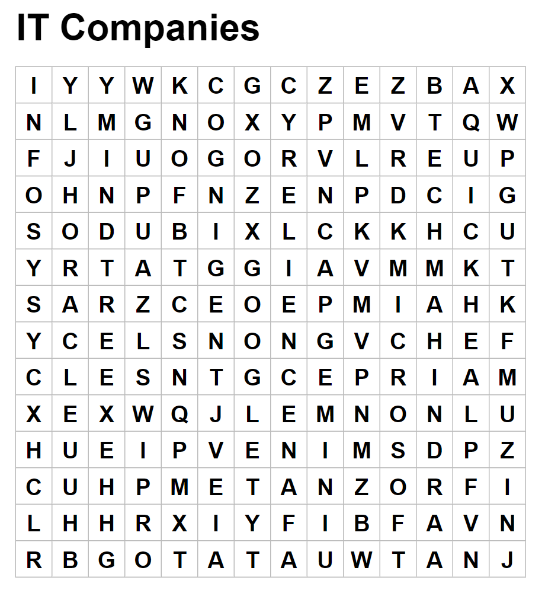
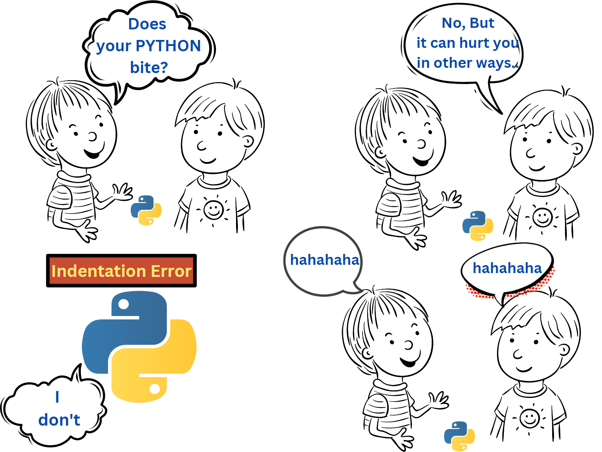

# Introduction to Python & Variables, Data Types

### Student Activity [10 min]: Word Search Puzzle

  Search Top IT Companies.



.png)

## What is Python?

.png)

- Python is an **interpreted**, **object-oriented**, **high-level** programming language with dynamic semantics.
- It was created by **Guido van Rossum** and released in **1991** at **CWI [Centrum Wiskunde and Informatica] Research Center, Netherlands**.

- It is a general-purpose language, meaning **it can be used to create a variety of different programs and isn't specialized for any specific problems.**

## Why the name Python?

- **Guido van Rossum** was reading the script of a popular BBC comedy series "**Monty Python's Flying Circus**". It was late on-air 1970s.
- Van Rossum wanted to select a name that said unique, sort, and mysterious. So, he decided to select naming **Python** after **"Monty Python's Flying Circus"** for their newly created programming language.
- The comedy series was **creative** and **well random**. It talks about everything. Thus, it is slow and unpredictable, which made it very interesting.

## Why Python?

- **Simple and Easy to Learn**
- **Dynamic**
- **Platform Independent**
- **Free and Open Source**
- **Interpreted (bytecode-compiled)**
- **Rich Library Support (more than 1,37,000 third-party python libraries)**
- **Embeddable and Extensible**
- **Portable**
- **Robust**
- **Exception Handling**



## [Instructor task: 5min] Discuss Indentation

discuss briefly with examples.

## Setup Replit[2-3 min]

- Go to [https://replit.com](https://replit.com/)
- Sign up with your Gmail account.
- Choose **Python** and it will open a window asking you to create a repl.
- Press create repl.
- A new window will open, On the **left side**, you will find the **code editor** and on the **right side** is the **terminal** where we can see our **output**.

.jpg)

## How to print or get output in Python?

### ***print( )***➖

The `print()` function prints the specified message to the screen or other standard output device.

The message can be **a string** or **any other object**, the object will be converted into a string before being written to the screen.


## **Python Comments**

- Comments can be used to explain Python code.
- They make the code more readable.
- They prevent execution when testing code.
- Comments are of two types:

## Variables

Variables are containers for storing data values.

---

## What are the basic mathematical operations?

.png)

The common operators in Javascript are :

- **Addition**
- **Subtraction**
- **Multiplication**
- **Division**

### Student Task: Students need to solve a problem [ 3 min ]

Problem: Given a = 15, b = 25 . Calculate sum, difference, product, and division.

### Real-world example


- Visit amazon.com, and add some products to the cart.
- Adding products leads to an increase in the cart price.
- Manipulating the quantity or Adding the items affects the total price. This is how Mathematical operators are used behind the picture.

## Modulo Operator(%) [Remainder] [ 20 min ]


- When we divide a number into another, there are 4 terms that we need to understand
    - **quotient**
    - **divisor**
    - **dividend**
    - **remainder**
- Looking at the above picture, you will get clear about the above terms
- The remainder represents by **%**.
    - For Ex: var result = 75 % 4 [ Read as 75 Modulus 4 ]

### Instructor Task: Show demo to students, Explaining Modulus [10 min ]

**Let's take the analogy**: 

- There are many candidates who came to the company office to give interviews.
- Since there are more than **100 candidates**, **4 interview panel setups** where one interviewer is used to take the interviews.
- A **unique Id** is assigned to each candidate, starting from 1,2,3........to 100. If Interview Panel 1 is assigned to ID 1, Interview Panel is assigned to ID 2, and so on.
- Now, the question is Which Interview Panel will be assigned to Candidate 25?
    - The Solution Lies in Modulus: Just calculate **25 % 4** [ Since there are 4 Interview Panel]
    - Result = 25 % 4 = 1
    - Candidate 25 is assigned to Interview Panel 1.
    
    .png)
    

- **The power of % lies in distributing**


### Student Task: Google Server Analogy [ 5 min ]

Also, Using the same analogy of 4 Google servers and more than 1000 requests coming in a sequence.

Which server will process the 63rd request?

## Exponentiation Operator(**) [10 min ]

### Instructor Task: Explain the exponentiation operator with examples, Also discuss the difference between * and **

- It is used to compute the power of any number
    - a = 4
    - b = 2
    - c = a**b = 4**2 = 4*4 = 16

### **Difference between * and ****

.png)

### Student Task: Find Square root using Exponentiation Operator [ 2 min ]

     Find the  Square root of 3 using the Exponentiation Operator

     **Solution :** result = 3**0.5

## How to Solve long expression? [ 5 min ]


### Instructor Task (5 mins): Discuss the steps to solve long expressions using brackets

- If you want to solve long expressions containing multiple operations then use brackets.
- Putting brackets also gives readability to code.
- For Ex :
    - **expr = ((a+b)*(c+d))/e**

### Student Task: Solve the Expression [ 5 min ]

- **For Ex** :
    
    **a = 3;**
    
    **b = 2;**
    
    **c = 4;**
    
    **sum = (a*2) + (b*2) + (c*2);     #(3*2)+(2*2)+(4*2)**
    
    **print(sum)      # 18 is the sum**
    

## String Concatenation

### Instructor Task (5 mins): Discuss examples of how to concatenate multiple strings

- Concatenation means a series of interconnected things.
- Use + to join two or more string

### Student Task: Students need to print their addresses. [ 5 min ]

- The problem statement is to store the following information into a unique variable i.e.
    - **House No**
    - **Area**
    - **City**
- The task is to print the complete address.

**Concatenation with Numbers**

```coffeescript
num1 = 2;
num2 = 3;
sum = num1 + num2;
print("Sum is ",sum);
```