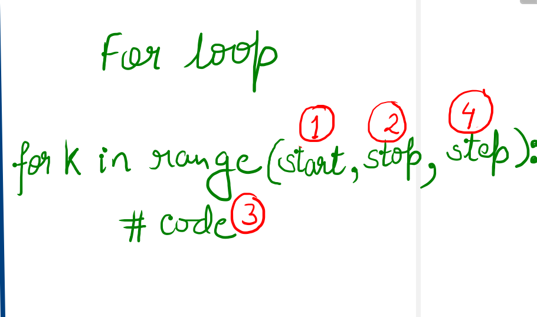

# Looping Like a Pro(For Loops and Nested Loops)

---

- **Notes:**
    
    ### For Loops:
    
    ---
    
    - In Python, the `for` loop is used to run a block of code a certain number of times.
    - It is used to iterate over any sequence such as a list, tuple, string, etc.
    - **SYNTAX**➖
    - Flowchart➖
    
    ## **Python for Loop with Python range()**
    
    ### **`range()`**➖ **This function returns a sequence of numbers between the given range.**
    
    We use this function to define a range of values.
    
    ### **Syntax of range()**
    
    The `range()` function can take a maximum of three arguments:
    
    ```python
    range(start, stop, step)
    ```
    
    The `start` and `step` parameters in `range()` are **optional**.
    
    .png)
    
    ### **range() in for Loop**
    
    ```python
    num=range(5);
    for i in num:
    	print(i)
    '''
    OUTPUT:-
    0
    1
    2
    3
    4
    '''
    ```
    
     **Note➖ if the start is not mentioned then it starts with a 0**
    
    ## How `range()` works with a different number of arguments.
    
    ### **range() with Stop Argument**➖
    
    - It returns a sequence of numbers starting from **0** up to the number (but not including the number). For Example➖
    - 0 and negative numbers are not allowed.
    
    ### **range() with Start & Stop Argument**➖
    
    - If two arguments are passed, it means they are Start and Stop only.
    - It returns a sequence of numbers from Start (inclusive) ****up to the Stop (exclusive).
    
    ### range() with Start, Stop and Step Arguments
    
    - If we pass all three arguments,
    - The `Step` argument specifies the incrementation between two numbers in the sequence.
    - It returns a sequence of numbers from Start (inclusive) ****up to the Stop (exclusive) and the difference between numbers is of Step.
    
    ```python
    for key in range(1,10,2):
    	print(key)
    
    '''
    OUTPUT -
    1
    3
    5
    7
    9
    '''
    ```
    
    **Note➖ The default value of Start is 0, and the default value of Step is 1.  That's why**
    
     **`range(0, n, 1)` is equivalent to `range(n)`**
    .
    
    ## Examples➖
    
    
    
    - Let’s say you want to display Coffee one time then you will print and do the print("Coffee") one time.
    - Similarly, If it is two then you will write print twice
    - Let’s say you want to display it 100 times. Without some sort of loop in your code, we would probably have to write the same line of code 100 times.
    
    A *for-loop* can help us to do so by running the same code repeatedly under certain conditions.
    
    ### The sequence of Execution of For Loop
    
    
    
    - Start -> Stop-> Loop Body/Code -> Step -> Stop -> Loop Body/Code -> Step and so one
    1. The **Start** is denoted as 1, the **Stop** is denoted as 2, **Loop Body** denotes as 3, **Step** is denoted as 4.
    1. Sequence of Execution will be : 1 -> 2 -> 3 -> 4 -> 2-> 3 -> 4 -> 2 -> 3 -> 4 and so on
    
    ## Examples of For Loop with Dry Run
    
    ### Example 1: Print Hello 4 times.
    
    .png)
    
    ```python
    for i in range(1,5,1):
    	print("Hello")
    ```
    
    ### Code 1**:  Print numbers from 1 to 5**
    
    ```python
    for i in range(1,6,1):
    	print(i)
    '''
    OUTPUT
    1
    2
    3
    4
    5
    '''
    ```
    
    ### Code 2: **Print 1 to 5 in a Horizontal manner (Concatenation)**
    
    ```python
    s="";
    for i in range(1,6,1):
    	s+=str(i)
    print(s)
    '''
    OUTPUT 
    12345
    '''
    ```
    
    Do the **dry run of the above code with the help of a table for better understanding and visualization.**
    
    W**hat will happen if you put the print statement inside the for loop what will happen.**
    
    ```python
    s="";
    for i in range(1,6):
      s+=str(i)
      print(s)
    '''
    OUTPUT 
    1
    12
    123
    1234
    12345
    '''
    ```
    
    **Do a dry run of the above code to make them visualize**
    
    Now, instead of putting an empty string in the s put **0** and make them visualize what will be changed.
    
    ```python
    s=0;
    for i in range(1,6):
    	s+=i
    print(s)
    '''
    OUTPUT-
    15
    '''
    ```
    
    Do a **dry run of the above code to make them visualize.**
    
    ### Code 3: **Run a reverse loop to print numbers from 5 to 1**
    
    ```python
    for i in range(5,0,-1):
    	print(i)
    '''
    OUTPUT
    5
    4
    3
    2
    1
    '''
    ```
    
    ### Code 4: **Run a reverse loop to print numbers from 5 to 1 in a horizontal manner**
    
    ```python
    bag=""
    for i in range(5,0,-1):
    	bag+=str(i)
    print(bag)
    '''
    OUTPUT
    54321
    '''
    ```
    
    if I Want to put a **space** in between the numbers 
    
    ```python
    bag=""
    for i in range(5,0,-1):
    	bag+=str(i)+" "
    print(bag)
    '''
    OUTPUT
    5 4 3 2 1
    '''
    ```
    
    ### Code 5: **Solve a factorial problem using the for loop**
    
    ```python
    fact=1;
    for i in range(1,6):
    	fact=fact*i;
    print(fact);
    # 120
    ```
    
    Do the **dry run of the above code to make them understand**
    
    ### Code 6: **Calculate the sum of even numbers from 1 to 50**
    
    ```python
    start=1;
    end=51;
    sum=0;
    for k in range(start,end):
    	if(k%2==0):
    		sum=sum+k;
    print(sum);  # 650
    ```
    
    Do the **dry run of the above code so that they can visualize.**
    
    ### Code 7: **Calculate the sum of even numbers from 1 to 50 and odd numbers from 1 to 50.**
    
    ```python
    start=1;
    end=51;
    sum_even=0;
    sum_odd=0;
    for i in range(start,end):
    	if(i%2==0):
    		sum_even=sum_even+i;
    	else:
    		sum_odd=sum_odd+i;
    print(sum_even+sum_odd); #1275
    ```
    
    Do the **dry run of the above code so that they can visualize.**
    
    ## Break & Continue
    
    **Story**➖ 
    
    ### **Break**
    
    It means coming out of the loop and stopping the execution.
    
    ```python
    for guest in range(1,11):
    	if(guest==4):
    		break;
    	print("Guest", guest);
    
    '''
    Output
    Guest 1
    Guest 2
    Guest 3
    '''
    ```
    
    Do the dry run using a table.
    
    ### **Continue**
    
    It ****is basically saying go back to the condition.
    
    ```python
    for guest in range(1,11):
    	print("Guest", guest);
    	if(guest==3):
    		continue;
    '''
    It will print all the guests as there is nothing to skip, because 
    no code has been written after the "continue" statement.
    '''
    
    for guest in range(1,11):
    	if(guest==3):
    		continue;
    	print("Guest", guest);
    
    # This code will skip the 3rd guest.
    ```
    
    ### Code 8: **Predict the output of the code written below.**
    
    ```python
    count=1
    for k in range(1,10):
      count+=1
      if(k==5):
        continue
    print(count) #Output is 10
    ```
    
    ### Code 9: Musical Chair Game (Continue &  Break)
    
    
    
    ```python
    import random
    music_S=0;
    music_E=10;
    randoms=int(random.random()*10)
    print(randoms)
    for i in range(music_S,music_E+1):
    	if(randoms<i):
    		continue;
    	else:
    		print("seat on chair");
    		break;
    
    ```
    
    ## While vs For
    
    .png)
    
    - Write the **syntax of the while loop** and **for loop side by side** to make them visualize that both the loops are the same.
    
    ---
    
    ### Nested Loops:
    
    [nestedLoop.mp4](nestedLoop.mp4)
    
    - A **nested loop** is a loop within a loop.
    - **Analogy**➖
        - Suppose you went to a Gol Gappa Shop and you ate 4 gol-gappas in a sequence. You can consider this as a loop where you have eaten 4 gol gappas in a sequence.
        - In another scenario, Suppose you went to a Gol Gappas Shop with 5 other family members. Each Member of the family ate 4 gol-gappas. You can consider this as a loop of 4 gol-gappas which run 5 times because of the 5 family members.
    
    
    
    ## Calendar Example - Nested Loop
    
    
    
    ## Week Repetition - Nested Loop
    
    
    
    The "**inner loop**" will be executed one time for each iteration of the "**outer loop**":
    
    - **SYNTAX**➖
        
        
        
    
    ## Dry Run of problem
    
    ### **Code 1: Nested loops for Gol Gappa example.**
    
    ```python
    for family in range(1,6,1):
      for gappas in range(1,5,1):
        print(family," ate ",gappas," Gol-Gappa");
    ```
    
    Dry run of the above code by making a table.
    
    ### Code 2: Grandfather and Sam are on their farm. Grandfather asked Sam to pick all the apples that are there and keep them in the basket.
    
    Show them the visual given below.
    
    **Version 1**
    
    [](https://www.canva.com/design/DAFTsm4D8CM/4p3pwjRhjA6yA9yVFGF7og/view?utm_content=DAFTsm4D8CM&utm_campaign=designshare&utm_medium=link&utm_source=homepage_design_menu)
    
    **Version 2**
    
    [](https://www.canva.com/design/DAFUvJnGdeI/vnr_5GV7ho3-mlVE9OphPw/view?utm_content=DAFUvJnGdeI&utm_campaign=designshare&utm_medium=link&utm_source=homepage_design_menu)
    
    ### Code 3:  **Print “Hello” in vertical order using a nested loop.**
    
    ```python
    for i in range(2):
      for j in range(3):
        print("Hello");
    ```
    
    Dry run of the above code by making a table.
    
    
    
    ### Code 4:  **Print “Hello” in horizontal order using a nested loop.**
    
    ```python
    for i in range(2):
      bag=""
      for j in range(3):
        bag+="Hello"+" "
      print(bag);
    ```
    
    Dry run of the above code by making a table.
    
    
    
    ## Father-Son Marathon
    
    
    
    There was a father who trains his son for the next Olympics running competition. Every day Father used to give some targets to his son
    
    ### Code 5:  **Father gave the son a target, of completing 10 sets. Each set contains 10 Rounds of a field.**
    
    ```python
    for father in range(1,11):
      for son in range(1,11):
        print("Father count", father,", Son completed ", son);
    ```
    
    ### **Let’s listen to a  story:**
    
    Once upon a time,  a father and son were farmers. They once decided that they do plantation of trees in their field. Since Father is very old, he is unable to do that much work whereas the son is proactive, that’s why the father’s responsibility is to make sure how many fields are done whereas the son has the responsibility of putting the seeds in the field.
    
    
    
    ### **Code 6: Father has 5 fields. Each field son needs to put 10 seeds**
    
    ```python
     ''' 
    	**********
      **********
      **********
      **********
      **********
     '''
    
    for father in range(5):
      bag = "";
      for son in range(10):
        bag = bag + "*";
      print(bag);
    ```
    
    ### **Code 7:  Father has 5 fields. Son needs to put the seeds in increasing order.**
    
    Field 1 → 1 seed
    
    Field 2 → 2 seed
    
    Field 3 → 3 seed
    
    Field 4 → 4 seed
    
    Field 5 → 5 seed
    
    ```python
    '''
    * 
    * * 
    * * * 
    * * * * 
    * * * * *
    '''
    
    for father in range(1,6):
      bag = "";
      for son in range(father):
        bag = bag + "* ";
      print(bag);
    ```
    
    ### Code 8: Print the below pattern
    
    ```python
    '''
    1
    1 2
    1 2 3
    1 2 3 4
    1 2 3 4 5
    '''
    
    for father in range(1,6):
      bag = "";
      for son in range(1,father+1):
        bag = bag+str(son)+" ";
      print(bag);
    ```
    
    ### **Code 9: Father has 5 fields. Son needs to put the seeds in decreasing order.**
    
    Field 1 → 5 seed
    
    Field 2 → 4 seed
    
    Field 3 → 3 seed
    
    Field 4 → 2 seed
    
    Field 5 → 1 seed
    
    ```python
    '''
    * * * * *
    * * * *
    * * *
    * *
    *
    '''
    
    for father in range(5,0,-1):
      bag = "";
      for son in range(father):
        bag = bag + "* ";
      print(bag);
    ```
    
    ### **Code 10: Print the below reverse pattern**
    
    ```python
    '''
    1 2 3 4 5
    1 2 3 4
    1 2 3
    1 2
    1
    '''
    
    for father in range(5,0,-1):
      bag = "";
      for son in range(1,father+1):
        bag = bag+str(son)+" ";
      print(bag);
    ```
    
    ### **Code 11: Combining Code 8 and Code 10 to form a pyramid.**
    
    ```python
    '''
    1
    1 2
    1 2 3
    1 2 3 4
    1 2 3 4 5
    1 2 3 4
    1 2 3
    1 2
    1
    '''
    for father in range(1,6):
      bag = "";
      for son in range(1,father+1):
        bag = bag+str(son)+" ";
      print(bag);
    for father in range(4,0,-1):
      bag = "";
      for son in range(1,father+1):
        bag = bag+str(son)+" ";
      print(bag);
    ```
    
    ## Nested Loop with While
    
    ### **Code 12: Use While Loop. Print the below pattern**
    
    ```python
     ''' 
    	**********
      **********
      **********
      **********
      **********
     '''
    
    father=1;
    while(father<=6):
      son=1;
      bag = "";
      while(son<=10):
        bag=bag+"*";
        son+=1;
      print(bag);
      father+=1;
    ```
    
    ## Break and Continue
    
    ### Break
    
    Sultan and Bahubali were good friends, but Sultan was the king whereas Bahubali doesn’t have any kingdom. Later Sultan gave one part of his empire to Bahubali with a condition that Bahubali will never try to cross the status of Sultan and if he tries then he will attack the Prithviraj clan.
    
    
    
    ### **Code 13: Using Break**
    
    ```python
    for sultan in range(1,11):
      for bahuballi in range(1,11):
        if(bahuballi>sultan):
          break
        print("sultan=",sultan," bahuballi=",bahuballi);
    ```
    
    In the above code, whenever the value of Bahubali becomes greater than Sultan, At that point, the inner loop of Bahubali will break [ **It means Sultan attacked his clan because Bahubali betray him, by not following his conditions**]
    
    ### Continue
    
    The below code gives the same output as the above code but the only difference is on break is that the execution will stop completely but in case of continuing the process will keep on skipping the step and execution will end only once the loop will be done.
    
    ### **Code 14: Using Continue**
    
    ```python
    for sultan in range(1,11):
      for bahuballi in range(1,11):
        if(bahuballi>sultan):
          continue
        print("sultan=",sultan," bahuballi=",bahuballi);
    
    ```
    
    ### **Code 15: Print the below pattern**
    
    ```python
    '''
    1
    *
    1 2
    * *
    1 2 3
    * * *
    1 2 3 4
    * * * *
    1 2 3 4 5
    * * * * *
    '''
    
    for father in range(1,6):
      bag1 = "";
      for son in range(1,father+1):
        bag1 = bag1+str(son)+" ";
      print(bag1)
      bag2 = "";
      for son2 in range(1,father+1):
        bag2 = bag2+"*"+" ";
      print(bag2)
    ```
    
    # **IW Assignment**
    
    ### **Code 16 :** **Print Prime Numbers from 1 to given limit**
    
    ```python
    # Problem 2: Print Prime Numbers from 1 to the given limit
    
    limit = 20;
    for number in range(1,limit+1):
      factors=0;
      for i in range(1,number+1):
        if(number%i==0):
          factors+=1;
      if(factors == 2):
        print(number,"is a prime number");
      else:
        print(number, "is not a prime number");
    ```
    
    ### **Code 17 :** **Print a box pattern**
    
    ```python
    '''Problem 3: Print a box pattern using *
    
    **********
    *        *
    *        *
    *        *
    *        *
    *        *
    *        *
    *        *
    *        *
    ********** 
    '''
    
    for i in range (1,11):
      bag="";
      for j in range(1,11):
        if(i==1 or i==10):
          bag = bag + "*";
        else:
          if(j==1 or j==10 ):
            bag = bag+"*";
          else:
            bag = bag+" ";
    
      print(bag);
    ```
    
    **Happy Coding!**