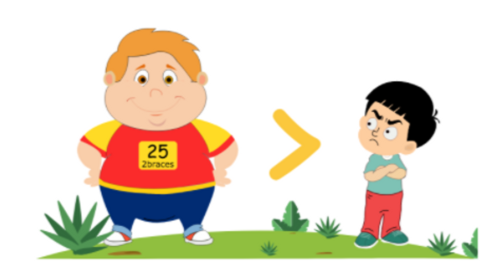
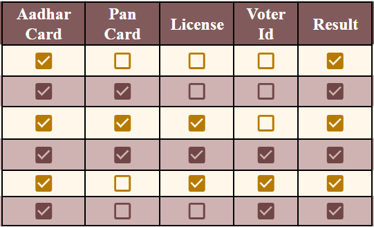
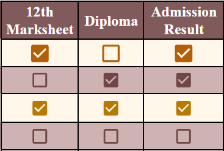

# Mastering Logic (Conditional Statements, Ternary & Logical Operators, and While Loops)

---

- **Outline:**
    
    ### Lecture Script: Mastering Logic in Python
    
    ### **Duration:** 1 hour 40 minutes
    
    ---
    
    ### **Introduction (5 minutes)**
    
    - **Objective:** Briefly introduce the session's topic and learning outcomes.
    - **Why:** Explain the importance of mastering logic in programming, emphasizing how it is fundamental to decision-making in software applications.
    
    ---
    
    ### **1. Conditional Statements (25 minutes)**
    
    ### **Introduction to Conditional Statements (5 minutes)**
    
    - **Definition:** Explain what conditional statements are and how they allow programs to execute different code paths based on conditions.
    - **Why:**
        - **Real-World Example:** Imagine you are a cashier at a store. Depending on the customer's purchase amount, you might apply a discount, offer a loyalty card, or charge the full price. Conditional statements in programming work similarly—they decide which path to take based on given conditions.
        - **Analogy:** Think of conditional statements like traffic lights. Just as traffic lights control the flow of cars based on different colors, conditional statements control the flow of code based on different conditions.
    
    ### **Types of Conditional Statements (10 minutes)**
    
    - **If Statement:** Introduce the `if` statement and how it evaluates a condition to execute code.
    - **Else Statement:** Explain how the `else` statement works when the `if` condition is not met.
    - **Elif Statement:** Introduce `elif` as a way to check multiple conditions.
    - **Why:**
        - **Real-World Example:** Consider an online shopping platform that recommends products based on your search history. If you search for books, it shows book recommendations. If you search for electronics, it shows gadgets. The platform uses conditional statements to decide what to show.
        - **Analogy:** Think of it like a recipe. If you have flour and eggs, you make pancakes. If you only have eggs, you make an omelet. If you have neither, you skip breakfast.
    
    ### **Exercise (10 minutes)**
    
    - **Task:** Write a Python script that checks the age of a person and prints whether they are a child (age < 12), a teenager (12 ≤ age < 20), an adult (20 ≤ age < 60), or a senior (age ≥ 60).
    - **Goal:** Ensure students can implement basic conditional logic to make decisions in code.
    
    ---
    
    ### **2. Ternary & Logical Operators (25 minutes)**
    
    ### **Introduction to Ternary Operators (5 minutes)**
    
    - **Definition:** Introduce the ternary operator as a shorthand way to write simple `if-else` statements.
    - **Why:**
        - **Real-World Example:** Think of a simple situation where you need to decide whether you should bring an umbrella. If it’s raining, you bring it; otherwise, you don’t. A ternary operator is like this quick decision-making process.
        - **Analogy:** It's like a coin flip where heads mean one outcome and tails another, but you decide the result instantly without needing to write it all out.
    
    ### **Introduction to Logical Operators (10 minutes)**
    
    - **Definition:** Explain logical operators (`and`, `or`, `not`) and how they combine multiple conditions.
    - **Why:**
        - **Real-World Example:** Suppose you are checking into a hotel. To get a room upgrade, you must be a loyalty program member (`and` condition) and have stayed there more than five times. Logical operators help combine these conditions.
        - **Analogy:** Imagine you're cooking. To make a cake, you need both flour and sugar (`and`). But to make either pancakes or waffles, you only need one of them (`or`).
    
    ### **Exercise (10 minutes)**
    
    - **Task:** Create a Python script using a ternary operator to check if a number is even or odd. Then, use logical operators to check if the number is both even and greater than 10.
    - **Goal:** Ensure students understand how to use ternary and logical operators to simplify and combine conditions.
    
    ---
    
    ### **3. While Loops (25 minutes)**
    
    ### **Introduction to While Loops (5 minutes)**
    
    - **Definition:** Introduce `while` loops and explain how they repeatedly execute a block of code as long as a condition is true.
    - **Why:**
        - **Real-World Example:** Imagine you’re waiting for a bus. You keep checking if the bus has arrived (`while` condition). Once it arrives, you stop checking.
        - **Analogy:** Think of a `while` loop like a merry-go-round. It keeps spinning (`executing`) until the operator turns it off (`condition is false`).
    
    ### **Using While Loops in Python (10 minutes)**
    
    - **Syntax:** Explain the syntax of `while` loops and how to avoid infinite loops.
    - **Why:**
        - **Real-World Example:** Consider a login system that keeps asking for a password until the correct one is entered. This is a practical use of a `while` loop in real-world applications.
        - **Analogy:** It’s like practicing a piano piece. You keep playing until you get it right.
    
    ### **Exercise (10 minutes)**
    
    - **Task:** Write a Python script that simulates a simple game where the user has to guess a number between 1 and 10. The game should keep running until the user guesses the correct number.
    - **Goal:** Ensure students can implement and control loops based on conditions.
    
    ---
    
    ### **4. Summary and Q&A (15 minutes)**
    
    - **Summary:** Recap the key points covered in the session.
    - **Q&A:** Open the floor for questions to clarify any doubts.
    
    ### **Homework (Optional)**
    
    - **Task:** Ask students to write a program that checks a list of grades and categorizes each as 'Pass' or 'Fail' based on a passing mark of 50. Encourage them to use conditional statements, ternary operators, logical operators, and loops.
    - **Goal:** Reinforce the concepts learned in the session with a practical task.
    
    ---
    
- **Notes:**
    
    ## What are Comparison Operators?
    
    Comparison operators are used for comparing two values.
    
    - There are 6 comparison operators:
    - The result of a comparison operator is always a boolean value.
    
    ### Greater Than Operator ( > )
    
    
    
    - The first value is strictly greater than the second value. For ex-
    - The first value is less than or equal to the second value. For ex-
    
    ### Instructor Task
    
           **Code 1: Check whether the Ram age is greater than Mohan or not**
    
    ### Students Task
    
          **Code 2: Check whether Sunil is passed or not, where the passing mark is 35**
    
    ### Greater Than Equal To Operator ( >= )
    
    - The first value is greater than or equal to the second value. For ex :
    - The first value is less than the second value. For ex :
    
    ### Less Than Operator ( < )
    
    
    
    - The first value is strictly less than the second value. For ex :
    - The first value is greater than or equal to the second value. For ex :
    
    ### Less Than Equal to Operator ( <= )
    
    - The first value is strictly less than or equal to the second value. For ex :
    - The first value is greater than the second value. For ex :
    
    [Untitled design (1).mp4](Untitled_design_(1).mp4)
    
    ### Problems
    
    ### Student Task
    
    **Code 5: Those customers will be eligible for the amazon discount whose spending is equal to or above 4000. Check whether a customer Sam is eligible for a discount or not**
    
    **Wrong Code**
    
    ```python
    minimum_purchase = 4000;
    sam_purchase = 5000;
    eligible_for_discount = sam_purchase>minimum_purchase;
    print(eligible_for_discount);
    
    ```
    
    - The problem with the above code, we have used only greater than but in the question it was given that “**eligible for the amazon discount whose spending is equal to or above 4000”.**
    
    **Correct Code**
    
    ```python
    minimum_purchase = 4000;
    sam_purchase = 5000;
    eligible_for_discount = sam_purchase>=minimum_purchase;
    print(eligible_for_discount);
    
    ```
    
    ### Student Task
    
    **Code 6: Check whether Heeralal is eligible for driving a vehicle in India.**
    
    - The legal age in India for driving a vehicle is 18 +.
    
    ### Equal ( == )
    
    It checks whether the two operands are identical or not.
    
    .png)
    
    **For Ex :**
    
     **5 == 5 is True,** 
    
    **"b" == "b" is True,** 
    
     **5 == "5" is False**
    
    ### **Instructor Task**
    
    **Code 7: On Replit**
    
    ```python
    	ram = "ram";
    	print(5==5);
    	print("masai"=="masai");
    	print(5=="5");
    	print(ram == "ram");
    	print(5=="ram");
    
    ```
    
    ### Students Task
    
    **Code 8: Find the output**
    
    ```python
    		a = 5;
    		b = 6;
    		c = "6";
    		d = -2;
    		e = "m";
    		print(b==c);
    		print(c==e);
    		print(a>=c);
    		print(d<=a);
    ```
    
    ### Not Equal ( ! = )
    
     **!=** opposite of **==**
    
    .png)
    
    **For Ex :** 
    
    ### Instructor Task
    
    **Code 9:  Find the output**
    
    ```python
    print(5==5);
    print(5!=5);
    print(6=="6");
    print(6!=7);
    print("a"=="a");
    print("a"!="a");
    
    ```
    
    ### Student Task
    
    **Code 10: Find the output**
    
    ```python
    	masai = 5;
    	a = "masai";
    	b = masai;
    	print(a==b);
    	print(a!=b);
    ```
    

---

 Discuss what are conditional statements and relate them to the daily life

Conditional Statements in Python perform different computations or actions depending on whether a specific Boolean constraint evaluates to **true or false**. 

Conditional statements are handled by **IF statements** in Python.


- Conditional statements are used **to decide the flow of execution based on different conditions**. If a condition is true, you can perform one action and if the condition is false, you can perform another action.
- Through Conditional Statements, we can control which code needs to run or which code will not run.
    
    
    
- Code runs based on certain conditions.
    - **For Ex:** let's understand with the analogy, the **traffic light controls the flow of vehicles on the road**. Depending upon the color of the light, the actions happened. If the light is green, then it is a signal to move whereas if the light is red then it is a signal to stop.
- **Based on the comparison, if the comparison is true then it will execute the one block of code otherwise another block of code.**

### Student Task (5 mins): Ask students to give some real-life examples of conditional statements

## Different Types of Conditional Statements

### Instructor Task (5 mins): Discuss types of conditional Statements

There are four types of conditional statements in Python.

1. If statement
2. If…Else statement
3. If…Elif…Else statement
4. Nested If

### **if Statement**

### Instructor Task (5 mins): Discuss the if statement with examples


- It is to specify a block of Python code to be executed if a condition is true.
- **SYNTAX**➖
    
    ```python
    if expression:
     Statement
    ```
    
    Here, the program evaluates the `expression` and will execute statement(s) only if the expression is `True`.
    
    If the expression is `False`, the statement(s) is not executed.
    
- In Python, the body of the `if` statement is indicated by the indentation. The body starts with an indentation and the first unindented line marks the end.
- Python interprets non-zero values as `True`. `None` and `0` are interpreted as `False`.

### Instructor Task (5 mins): Discuss the if statement with 3 scenarios: with Boolean Value, with Expression, and with Variables

### a) If with Boolean Value

```python
print("Code Start")
if True:
	print("Inside Code")
print("Code End")
```

### b) If with Expression

- The decision is based on the value of Expression

For Example :

```python
if(5>3):
  print("Inside Code")
```

### c) If with Variables

- The decision is based on the value of Expression

For Example :

```python
name1 = "Rahul";
name2 = "Rahul";
check = (name1==name2);

if(check):
  print("Both Names are same");
```

### Student Task: Task For Students

### **Code 1: Check Whether two numbers are equal**

```python
a = 2;
b = 3;
c = (a==b);
if(c):
  print("a and b are equal");
```

## Indentation in Python

- Indentation is a very important concept of Python because without properly indenting the Python code, you will end up seeing an **Indentation Error** and the code will not get compiled.
- Python relies on **indentation (whitespace at the beginning of a line)** to define the scope of the code. Other programming languages often use **curly brackets** for this purpose.
- It refers to adding white space before a statement to a particular block of code. In another word, all the statements with the same space to the right, belong to the same code block.
- For Ex➖
    
    ```python
    print("Hello Python")
    if(5>9):
    	print("Yes....")
    else:
    	print("No...")
    print("Bye Python")
    ```
    

### **if…else Statement**

### Instructor Task (5 mins): Discuss the if/else statements with real-life examples


- The `if...else` is a type of conditional statement that will execute a block of code when the condition in the `if` statement is `truthy`. If the condition is `falsy`, then the `else` the block will be executed.
- Here is a list of `falsy` values:
    - empty sequences (**lists, tuples, strings, dictionaries, sets**)
    - zero in every numeric type
    - None
    - False
- If the condition is true, then one block of code executes.
- Else another block of code executes.
- **SYNTAX➖**
    
    ```python
    if expression:
     Statement
    else : 
     Statement
    ```
    

### **Code 2: Check which number is greater**

```python
a = 3;
b = 20;
if(a>b):
  print("a is greater than b");
else:
  print("a is not greater than b");
```

### Student Task: Task For Students

### **Code 3: Check Whether two names are equal or not**

```python
name1 = "Suraj";
name2 = "suraj";

if(name1==name2):
  print("Names are Equal");
else:
  print("Names are not equal");

```

### Hotel Bill Discount

### Instructor Task (5 mins): Understanding if-else with Hotel Bill Example

   


### Student Task: Task For Students

### **Code 4: Given total_bill, discount_start_price if you satisfy the condition Print Discount Available Otherwise print No Discount**

```python
total_bill = 699;
discount_start_price = 500;

if(total_bill>=discount_start_price):
  print("Discount Availaible");
else:
  print("No discount");
```

### **if…elif…else statement**

### **Flowchart**


- **SYNTAX➖**
    
    ```python
    if expression:
        Body of if
    elif expression:
        Body of elif
    else: 
        Body of else
    ```
    
- The `elif` is short for else if. It allows us to check for multiple expressions.
- If the condition for `if` is `False`, it checks the condition of the next `elif` block and so on.
- If all the conditions are `False`, the body of else is executed.
    
    
    
- Only one block among the several `if...elif...else` blocks is executed according to the condition.
- The `if` block can have only one `else` block. But it can have multiple `elif` blocks.

### Bill and Discount

**Problem Statement:** According to the total_bill, the discount will be applied.

.png)

**Code 5: For a Restaurant, write the program for the following total_bill > 500 Then print 10% discount total_bill > 1000 Then print 20% discount Otherwise No discount**

```python
total_bill = 799;
if(total_bill > 1000):
  print("20 % discount");
elif(total_bill > 500):
	print("10 % discount");
else:
	print("No discount")
```

### If-Elif vs if-if-if :

### Instructor Task

**Code 6: If-Elif**

- ***My mother told me to get any one of the things from the market**
1. **If Rice is available then print Buy rice**
2. **Else If wheat is available then print buy wheat**
3. **Else If apple is available then print buy apple****

```python
rice_availaible = False ;
wheat_availaible = True;
apple_availaible = True;
if(rice_availaible):
  print("Buy rice");
elif(wheat_availaible):
  print("Buy Wheat");
elif(apple_availaible):
  print("Buy apple");
else:
  print("Nothing is available");
```

**Code 7:  If - If - If**

- ***My mother told me to get all of the things if available from the market**
1. **If Rice is available then print Buy rice**
2. **If wheat is available then print and buy wheat**
3. **If apple is available then print buy apple****

```python
rice_available = True ;
wheat_available = True;
apple_available = False;

if(rice_available):
  print("Buy rice");
if(wheat_available):
  print("Buy Wheat");
if(apple_available):
  print("Buy apple");
```

### Nested if

**Code 8: Solve the Marriage Problem** ➖

**Legal Age in India Males ----> 21**

**Females ----> 18**

### Student Task

```python
gender = "female";
age = 21;
if(gender == "male"):
  if(age>=21):
    print("Males : get marry");
  else:
    print("Males : Can't get marry");
else:
  if(age>=18):
    print("Females : get marry");
  else:
    print("Females: Can't get marry");
```

**Code 9 : Given a char , you need to print whether the char is a vowel or not vowels : a, , i, o, u**

```python
char = "z"
if(char == "a"):
  print("vowel");
elif(char == "e"):
  print("vowel");
elif(char == "i"):
  print("vowel");
elif(char == "o"):
  print("vowel");
elif(char == "u"):
  print("vowel");
else:
  print("Not a vowel");
```

## IW Assignment

- IW assignment means I WE Assignment, here we solve some questions in the class. So, that students will get comfortable with the problems.
- In this IW Assignment, we will take some problems and work on the solution together with students

### **Problem 1: If the number is divisible by 3, print a "multiple of 3".**

```python
		number = 16;
		remainder = number % 3;
		if(remainder == 0):
			print("Multiple of 3");
		else:
			print("Not multiple of 3");
```

### **Problem 2: If a person is allowed to drive in India print "Apply for a license" or "NA".**

```python
yob = 1995;
age = 2022-yob;
print(age);
if(age >= 18):
  print("Can Apply for license");
else:
  print("NA");
```

### **Problem 3: Given 2 numbers a and b print which is greater or "both equal".**

```python
a = 10;
b = 10;
if(a>b):
  print("A is greater");
elif(b>a):
  print("B is greater");
else:
  print("Both are equal");
```

### **Problem 4: Given the stored username and password and input username and password, Print if the user can log in or not.**

```python
stored_username = "Varun";
stored_password = "varun@123";

input_user = "Varun";
input_password = "varun@123";
if(input_user == stored_username):
  if(input_password == stored_password):
    print("Valid login");
  else:
    print("Invalid Password");
else:
  print("Wrong username");
```

### Student Task (ice breaker)[10 min]: Slido Quiz asking

### **Who is your role model?**

## Ternary Operator

### Instructor Task (5 min):  Introduce them to the **ternary operator**

- Ternary operators also known as **conditional expressions** are operators that evaluate something based on a condition being true or false.
- It was added to Python in version **2.5.**
- It simply allows testing a condition in a **single line** replacing the multiline if-else making the code compact.
- Syntax➖
    
    ```python
    [on_true] if [expression] else [on_false]
    ```
    
- For ex-
    
    ```python
    # to check whether a number is odd or even
    a=10;
    print("Even Number") if(a%2==0) else print("Odd Number"); 
    ```
    
- For ex-
    
    ```python
    a = 409
    b = 409
    print("A") if a > b else print("=") if a == b else print("B")
    ```
    

---

## Logical Operators

### Instructor Task (5 mins): Discuss What is Logical operators.

- A **logical operator** is a symbol or word used to connect two or more expressions.
- The logical operators are important in python because they allow you to compare variables and do something based on the result of that comparison.
- **For example**, if the result of the comparison is `true`, you perform a block of code; if it’s `false`, you perform another block of code.

Whenever we need to connect two statements.

In the Last class, we learn about conditional statements, which say that if one condition is true then do X otherwise do Y.

**For Example:** In traffic lights, If the lights are green then Move and if the lights are red then Stop.

But In reality, there might be multiple conditions on which some result depends.

## Types of Logical Operators

Python provides three logical operators:

1. and 
2. or 
3. not 

### Logical and Operator (and)

### Instructor Task (5 mins): Discuss Logical AND operator with some examples

- In a chain of `and`, each value will be evaluated from left to right. If any of these values happen to be **false**, that value will be returned and the chain will not continue.
    
    
    

- **For Example:**
    - Suppose I need to submit some documents in Masai, and the documents are my pan card and License Id then only I will get admission. **Here**, you can observe that I will only get admission only when I have the PAN Card and License Id (Both are important).
    - If the batsman hit the ball with a bat **AND** it catches by the fielder then he will be out.
- Our Boolean operators take the input values as boolean and produce the result in boolean.
- In python, we use to denote the AND operator in this way ”**and”**.
- **Input (Boolean Value) ——and-—> Output (Boolean Value)**

### **Code 1: AND Operator**

```python
a = True;
b = True;
c = a and b;
print(c);
a = True;
b = False;
print(a and b);
a = False;
b = True;
print(a and b);
a = False;
b = False;
print(a and b);
```

### **Code 2:  AND with numbers**

```python
a = 5>3;
b = 6>3;
c = a and b;
print(c);
```

### **Code 3 : if/else**

```python
# Ist Part: Without AND

if(5>3):
	if(6>3):
		print("Both are true");

 # IInd Part: With AND

if(5>3 and 6>3):
  print("Both are true");
```

### **Code 4 : Combination of multiple statements**

```python
print((5<4) and (3>1) and (2>1) and (4<1))
```

### Student Task (5 mins): Solve the following problem

### **Code 5 : [Student Task] Check whether Rahul passed or not**

```python
#For English Subject, Check whether Rahul passed or not

subject = "english";
passing_marks = 70;
rahul_marks = 75;
rahul_subject = "english";
if((rahul_subject == subject) and (rahul_marks >= passing_marks)):
	print("Rahul Passed");
else:
  print("Rahul not passed");
```

### Student Task (5 mins): Solve the following problem

### **Code 6 : [Student Task] Marriage Problem**

**Gender is male and age ≥ 21 : He can marry**

**Gender is female and age ≥ 18 : She can marry**

```python
gender = "male";
age = 21;

if((gender == "male") and (age >= 21)):
	print("Male : Can Marry");
elif((gender == "female") and (age >= 18)):
  print("Female : Can Marry");
else:
	print(gender,"Can't get Marry");
```

### **Code 7 : Differentiate between ,(coma) and +**

```python
a = 2;
b = 3;
c = "hello";
print(a,b,c);
# print(a+b+c) gives error

# Case 2: Integers
d= 2;
e =3;
print(d+e);
print(d,e);

#Case 3: Strings
f = "Hello";
g = "World";
print(f+g);

#Case 4: Integer with Strings
h= 2;
i = "hello";
print(h,i);
# print(h+i);  gives error

#Case 5: "\n"
j = 2;
k = "hello";
print(j,"\n",k);
```

### **Code 8:  Mom wants to make Palak Paneer, So she sends sunny to the shop to buy Palak and paneer.**

Since she asked for Palak paneer. In this case, both items Palak and paneer are required to make Palak paneer, if any of the items are not available in the shop then it is not possible to make a Palak paneer dish.

```python
palak_availaible = False;
paneer_availaible = False;

if(paneer_availaible and palak_availaible):
  print("Today, we will have a party");
else:
  print("No Party");
```

### Logical or Operator (or)

- The `or` operator behaves exactly like the `and` does, only in reverse! While a chain of `and` s  will break if a falsy value is found, a chain of `or`s will break when it finds a **truthy** value. And, just like with the **`and`** s, if there are no truthy values and the end of the chain is reached, the last value in that chain is returned.
- If any of the statement is true, then the result will be true
    
    
    

- **For Example,** Drivezy is a Renting bike service Startup, If you want to rent a bike then you need to submit any of the Identity Document
    
    **Aadhar Card or PAN Card or License or Voter id Card**
    
    
    



      and many more cases are possible.

**Observation :**

1. If any of the cases is true then the final result will be true.
1. If all the cases are false, then only the result will be false.
- **Example**➖
    - **Masai asks for documents After Msat is in the documentation phase, either submit the 12th Mark Sheet or Diploma.**
    
    
    
       Show in Replit
    
    - **What do you prefer?**
    - **Boy want ice-cream but confused which one.**

### **Code 9: OR Operator**

```python
a = True;
b = True;
c = a or b;
print(c);

a = True;
b = False;
print(a or b);

a = False;
b = True;
print(a or b);

a = False;
b = False;
print(a or b);
```

### Student Task (5 mins): What is the output of the following

### **Code 10 : [Student Task ] OR Operator**

1. (True or False or True)
2. (False or True or False)
3. (False or False or True)

### **Code 11: Mom wants to prepare something for dinner, and she decides that they will make Potato or Paneer, So she sends sunny to the shop to buy potato or paneer.**

Since, Either she will prepare potato or paneer for the dinner. In this case, if any of the items are available in the shop then it is possible to prepare dinner.

```python
potato_availaible = True;
paneer_availaible = False;

if(potato_availaible or paneer_availaible):
  print("Dinner : Possible");
else:
  print("Dinner : Not Possible");
```

### **Code 12: Marriage Problem**

**Male: age≥21,   Female: age≥18**


```python
gender = "female";
age = 18;

if((gender == "male" and age>=21) or (gender == "female" and age>=18)):
	print(gender,": Can get Married");
else:
	print(gender,": Can't get married");
```

### Logical not Operator (not)

- On applying to a boolean value, the *not* operator turns *true* to *false* and *false* to *true*.


- For Example :
- For any website, there are multiple roles
    - Admin
    - User
    
    ```python
    admin_access = False;
    if(not admin_access):
      print("Access Denied");
    else:
      print("Welcome");
    ```
    

- The boolean NOT operator is represented with the word `**not**`.
- The operator accepts a single argument and converts it into a boolean and then **it inverses the output.**
- Example➖
    - When the umpire asks for the option of **Head or Tail.**
    - **Not Friends == Enemies**


## IW Assignment

### **Code 13:**

```python
'''Problem 1: Given the year of birth, if the
  1. Age between 13 and 19 (both included) print Teenage and
  2. Age between 20 and 29 (both included) print Twenties'''
yob = 1996;
age = 2022-yob;
print(age);
if(age >= 13 and age <= 19):
  print("Teenage");
elif(age >= 20 and age <= 29):
  print("Twenties")
```

### **Code 14 :**

```python
# Problem 2: Given any character, if it is a vowel print "Vowel"

char = "i";
if((char == "a") or (char=="e") or (char=="i") or (char=="o") or (char=="u") ):
  print("is a vowel");
else:
  print("not a vowel");
```

### **Code 15 :**

```python
# Problem 4: Given 3 numbers (all different values), print which is the greatest

a = 15;
b = 15;
c = 15;

#a is greatest, b is greatest, c is greatest
if((a>b) and (a>c)):
  print("a is greatest");
elif((b>a) and (b>c)):
  print("b is greatest");
elif((c>a) and (c>b)):
  print("c is greatest");
else:
  print("All are equal");
```

### Code 16: Sam wants to throw a party; he calls an event organizer and gives instructions about an entry that only those people will get an entry who are belongs to the family or those who are invited.


```python
Invitation_card = False;
family_member = True;

if(Invitation_card or family_member):
	print("Allow Entry!!");
else:
	print("Not Allowed!!");
```

---

## **Increment and Decrement Operators in Python**

### Increment and Decrement

- **Increment means increasing the value.**
    
    
    
- **Decrement means decreasing the value.**
    
    
    

```python
#Increment

x=5;
x=x+1;
print(x); # 6 (Incrementing the value x by 1)

y=6;
y=y+4;
print(y); # 10 (Incrementing the value of y by 4)

#Decrement

x=5;
x=x-1;
print(x); # 4 (Decrementing the value x by 1)

y=6;
y=y-4;
print(y); # 2 (Decrementing the value of y by 4)
```

### Student Tasks➖

### Code 1: Play Increment-Decrement Game

```python
x=10;
x+=1;
x=x+5;
x=x+10;
print(x);   # 26
x-=10;
x=x-5;
print(x);   # 11
```

### Code 2: Find the value of a, b, c and d

```python
a=10;
c=a+1;
b=10;
d=b+1;
print(a); # 10
print(b); # 10
print(c); # 11
print(d); # 11
```

### Code 3: Find the value of a, b, c and d

```python
a=6;
b=a-1;
c=10;
d=c-1;
print(a); # 6
print(b); # 5
print(c); # 10
print(d); # 9
```

## Loops

- Take the example of **SPOTIFY or GANA.com**, there is a thing called a loop, that plays something over and over again.
    
    
    

- **Guests Coming** ➖There are 10 guests coming to my home, After 2-3 days they decided to leave their home. They all have the train on the same day and at the same time. I need to drop them off at the railway station but I have one bike which can only take one person at a time.
    
    In this case, I need to drop each guest one by one. Taking the First guest to the railway station, dropping them off, and arriving back and following the same procedure again and again till the end.
    
    .png)
    
- **Loop Examples**➖
    - ***Days of the week***➖
    
    ```python
    	# Sunday->Monday->Tuesday->Wednesday->Thrusday->Friday->Saturday->Sunday
    ```
    
    - ***Alarm clocks give an alarm only when they match the time or condition by a person else clock hand moving in the loop without failing.***
    - ***Months of the year***
- Python has two primitive loop commands:
    - **while loops**
    - **for loops**

## While Loop

- The while loop begins with a condition and it is written like an if statement. The inner parenthesis is the condition.
- As long as the **condition is true**, it will continue to **execute the statement(s)**.
- To **stop the loop**, the **condition must eventually become false**.
- A common condition is to have a variable be less than or greater than compared to a number.
- Within the statements, that **variable will be incremented or decremented depending on the condition**.
- **Each time** the loop is executed, **the variable will change** and eventually become larger or less than the number in the condition, stopping the loop.
- Give an example of a **1m jump till the person is reaching the 100m mark**
    
    
    

- **SYNTAX**➖
    
    ```python
    starting_point  # called as initialization
    
    while(till_when_he_will_jump):     # condition to terminate the loop
    
    	# operation that is to be performed
    
    	how_many_jump_at_a_time          # Increment/decrement
    ```
    
- **Taking the above marathon example**➖
    
    ```python
    jump=1;
    while(jump<=100):
    	print("jump");  #will print jump 100 times
    	jump=jump+1;
    ```
    
- **Dry Run of the above code for better visualization**➖
    
    
    
- Table for **DRY RUNNING**.
    
    
- Dry run again after removing the increment statement to make them understand the importance of it.
- **It will run for infinite times.**
- Show it on **REPLIT.**

.png)

### **Activity Time:**

### Code 4: **Print “Hello World” 10 times.**

```python
i=1;
while(i<=10):
	print("Hello World");
	i=i+1;
```

### Code 5: **Print numbers from 1 to 5**

```python
i=1;
while(i<=5):
	print(i);
	i+=1;
```

- Do a dry run by making a table.

### Code 6: **Take the same examples and tell them if I increment by 2 then what will happen?**

```python
jump=1;
while(jump<=100):
	print("jump", jump); #will print jump 50 times
	jump=jump+2;
```

### Code 7:  **Do the Jump question by making 5 jumps.**

```python
jump=1;
while(jump<=100):
  print("jump", jump); 
  jump=jump+5;
```

### Code 8**:** **Do the Jump question by making 15 jumps.**

```jsx
jump=1;
while(jump<=100):
	print("jump", jump); 
	jump=jump+15;
```

## Note➖ **You can start from any point not necessarily from 1 or 0.**

### **Talk about Reverse Loops also, using the decrement operation,**

**taking the same marathon example, make them think about the condition as well.**

### **Code 8: Reverse Loop from 100 to 0 [ 1 unit jump at a time ]**


```python
position = 100;
while(position>=0):
  print("Current Position",position);
  position = position - 1
```

### Sending Notice to 1000 Employees

.png)

## Break & Continue

### Break

- **Break** means to come out of the loop and stop the execution.
- **Guest Analogy**
    - There are 10 guests coming to my home, After 2-3 days they decided to leave their home.
    - They all have the train on the same day and at the same time.
    - I need to drop them off at the railway station but I have one bike which can only take one person at a time.
    - In this case, I need to drop each guest one by one.
    - Taking the First guest to the railway station, dropping them off, and arriving back and following the same procedure again and again till the end.
    - Suppose I took the First Guest and dropped him to the Railway station and come back.
    - Again I took the Second Guest and follow the same.
    - Now, Next, I took the third guest to the Railway station and found that Train has gone.
    
    
    
    **So, Will I continue the above procedure or stopped it?**
    
    Obviously, I will stop it and wait for tomorrow.
    

### **Code 9: Loop from 0 to 10 (using break)**

```python
guest=1;
while(guest<=10):
	if(guest==4):
		break;
	print("Guest", guest);
	guest+=1;

'''
Output

Guest 1
Guest 2
Guest 3
'''
```

- Do the dry run using a table.

### Continue

- **Continue** is basically saying go back to the condition.
- **Guest Analogy**
    - There are 10 guests coming to my home, After 2-3 days they decided to leave their home.
    - They all have the train on the same day and at the same time.
    - I need to drop them at the railway station but I have one bike which can only take one person at a time.
    - In this case, I need to drop each guest one by one.
    - Taking the First guest to the railway station, dropping them off, and arriving back and following the same procedure again and again till the end.
    - Suppose I took the First Guest and dropped him to the Railway station and come back.
    - Again I took the Second Guest and follow the same.
    - Suppose the third guest is Sick, In that case, I will skip him.
    - and I will continue with the fourth guest and follow the same procedure.

### **Code 10: Loop from 0 to 10 (using continue)**

```python
guest=0;
while(guest<=10):
  guest+=1;
  if(guest==3):
	  continue;
  print("Guest", guest);
```

### **Code 11 : Find Sum of 1 to 10**

```python
'''Problem:
		Sum of 1 to 10
		1 + 2 + 3....... + 10  '''

var i = 1;
var sum = 0;

while(i<=10)
{
  sum = sum+i;
  i++;
}

console.log(sum);
```

## The else Statement with While in Python

With the else statement we can run a block of code once when the condition no longer is true:

```python
i = 1
while i < 6:
  print(i)
  i += 1
else:
  print("i is no longer less than 6")
```

# IW Assignment

### **Code 12:** Problem 1: Print the numbers from the given starting point till the ending point (including both start and end)

```python
starting = 5;
ending = 25;
while(starting<=ending):
	print(starting);
	starting+=1;
```

### **Code 13:** Problem 2: Print the odd numbers from 0 till the given limit

```python
start = 2;
limit = 50;
while(start<limit):
  if(start % 2 == 1):
    print(start);
  start = start + 1;
```

### **Code 14:** Problem 3: Print the sum of all the multiples of 3 from 0 to the given limit

```python
start = 0;
limit = 20;
sum = 0
while(start<=limit):
  if(start % 3 == 0):
    sum=sum+start;
  start=start+1
print(sum);
```

### **Code 15:** Problem 4: Print the average of even numbers from 1 to 100 (both included)

```python
starting = 1;
ending = 100;
sum_of_even = 0;
count_even_numbers = 0;
while(starting<=ending):
  if(starting%2 == 0):
    sum_of_even = sum_of_even + starting;
    count_even_numbers+=1;
  starting+=1;
average = sum_of_even/count_even_numbers
print(average);
```